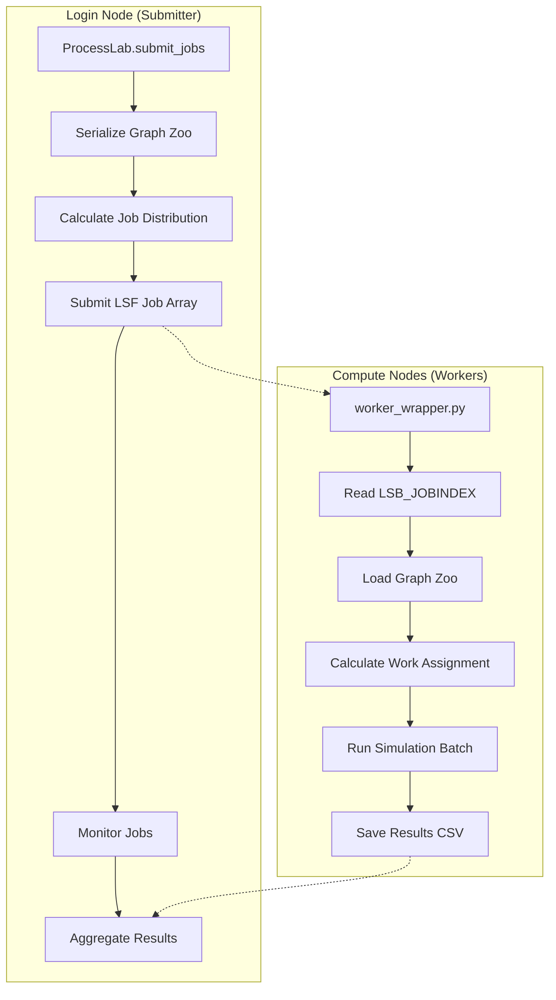

# Design Document: HPC Cluster Execution

## Overview

This design document outlines the architecture for refactoring ProcessLab to support distributed High Performance Computing (HPC) execution using LSF (Load Sharing Facility). The solution implements a "Submitter-Worker" pattern where a login node orchestrates job submission and compute nodes execute simulation batches in parallel.

The design maintains backward compatibility with existing local execution while adding new capabilities for large-scale distributed computing. The core approach uses LSF job arrays to efficiently submit thousands of jobs with a single command, with each worker handling multiple simulation repeats to optimize job overhead.

## Architecture

The system follows a three-phase distributed computing pattern:

1. **Preparation Phase**: Serialize graph objects and calculate job distribution
2. **Execution Phase**: Submit LSF job array and execute simulations on compute nodes  
3. **Aggregation Phase**: Collect and merge results from all worker jobs



## Components and Interfaces

### ProcessLab Extensions

The existing ProcessLab class will be extended with new methods for HPC execution while maintaining full backward compatibility:

```python
class ProcessLab:
    # Existing methods remain unchanged for backward compatibility
    def run_comparative_study(self, graphs, r_values, n_repeats=100, 
                             print_time=True, output_path=None):
        """Original local execution method - unchanged"""
    
    @staticmethod
    def save_results(df, output_path):
        """Original save method - unchanged"""
    
    # New HPC execution methods
    def submit_jobs(self, graphs, r_values, n_repeats, 
                   n_jobs=None, output_path=None, repeats_per_job=None,
                   queue=None, memory="4GB", walltime="2:00", **lsf_options):
        """
        Submit comparative study as LSF job array with configurable parameters.
        
        :param graphs: List of PopulationGraph objects
        :param r_values: List of selection coefficients  
        :param n_repeats: Total number of repeats across all jobs
        :param n_jobs: Number of LSF jobs (auto-calculated if None)
        :param output_path: Path for final aggregated results
        :param repeats_per_job: Repeats per job (auto-calculated if None)
        :param queue: LSF queue name
        :param memory: Memory per job (e.g., "4GB", "8GB")
        :param walltime: Wall time limit (e.g., "2:00", "4:30")
        :return: Job tracking information including job IDs
        """
        
    def aggregate_results(self, temp_dir, output_path, cleanup=True):
        """
        Merge individual worker CSV files into master dataset.
        
        :param temp_dir: Directory containing worker result files
        :param output_path: Path for final aggregated CSV
        :param cleanup: Whether to remove temporary files after aggregation
        :return: Summary statistics (total simulations, missing files)
        """
        
    def _serialize_graphs(self, graphs, filepath):
        """
        Serialize graph zoo to pickle file with metadata preservation.
        
        :param graphs: List of PopulationGraph objects
        :param filepath: Output pickle file path
        :raises: SerializationError if graphs cannot be serialized
        """
        
    def _calculate_job_distribution(self, n_graphs, n_r_values, n_repeats, 
                                   repeats_per_job=None):
        """
        Calculate optimal work distribution across jobs.
        
        :param n_graphs: Number of graphs in study
        :param n_r_values: Number of r_values in study  
        :param n_repeats: Total repeats requested
        :param repeats_per_job: Target repeats per job
        :return: (n_jobs, actual_repeats_per_job) tuple
        """
```

### Worker Wrapper Script

A new standalone script `worker_wrapper.py` serves as the entry point for compute nodes with comprehensive argument parsing and error handling:

```python
#!/usr/bin/env python3
"""
LSF worker script for ProcessLab distributed execution.
Reads job index, loads graphs, runs assigned simulations.
"""

import argparse
import os
import sys
from pathlib import Path

def main():
    parser = argparse.ArgumentParser(
        description="ProcessLab HPC worker for distributed simulation execution"
    )
    parser.add_argument('--graph-file', required=True, 
                       help='Path to serialized graph zoo pickle file')
    parser.add_argument('--r-values', required=True, nargs='+', type=float,
                       help='List of selection coefficients to process')
    parser.add_argument('--repeats-per-job', required=True, type=int,
                       help='Number of repeats this job should execute')
    parser.add_argument('--output-dir', required=True,
                       help='Directory for output CSV files')
    
    args = parser.parse_args()
    
    # Read LSF job index with error handling
    try:
        job_index = int(os.environ['LSB_JOBINDEX'])
    except (KeyError, ValueError) as e:
        print(f"ERROR: Failed to read LSB_JOBINDEX: {e}", file=sys.stderr)
        sys.exit(1)
    
    # Validate arguments
    if args.repeats_per_job <= 0:
        print("ERROR: repeats-per-job must be positive", file=sys.stderr)
        sys.exit(1)
        
    if not Path(args.graph_file).exists():
        print(f"ERROR: Graph file not found: {args.graph_file}", file=sys.stderr)
        sys.exit(1)
    
    # Execute job with comprehensive error handling
    try:
        worker = ProcessLabWorker(args)
        worker.execute_job(job_index)
    except Exception as e:
        print(f"ERROR: Job {job_index} failed: {e}", file=sys.stderr)
        sys.exit(1)

if __name__ == "__main__":
    main()
```

### Job Distribution Algorithm

The system distributes work using a round-robin approach across the Cartesian product of (graphs × r_values):

```python
def calculate_work_assignment(job_index, n_graphs, n_r_values, repeats_per_job):
    """
    Calculate which (graph, r_value) combination and repeat range 
    this job should process based on LSB_JOBINDEX.
    """
    total_combinations = n_graphs * n_r_values
    combination_index = (job_index - 1) % total_combinations
    
    graph_index = combination_index // n_r_values
    r_index = combination_index % n_r_values
    
    repeat_start = ((job_index - 1) // total_combinations) * repeats_per_job
    repeat_end = repeat_start + repeats_per_job
    
    return graph_index, r_index, repeat_start, repeat_end
```

## Data Models

### Serialization Format

Graph objects are serialized using Python's pickle module with protocol version 4 for compatibility and comprehensive metadata preservation:

```python
# Serialization structure
{
    'graphs': [PopulationGraph, ...],  # List of graph objects with full state
    'metadata': {
        'n_graphs': int,
        'graph_names': [str, ...],
        'serialization_time': datetime,
        'python_version': str,
        'processlab_version': str,      # For compatibility tracking
        'checksum': str                 # Data integrity verification
    }
}
```

**Design Rationale**: Pickle protocol 4 ensures compatibility across Python 3.4+ while preserving all graph properties, metadata, and calculated values. The checksum enables corruption detection during deserialization.

### Result File Format

Each worker produces a CSV file with unique naming to prevent conflicts and comprehensive metadata preservation:

```csv
wl_hash,graph_name,r,fixation,steps,initial_mutants,selection_coeff,duration,job_id,repeat_id
abc123,complete_n20,1.1,True,1250,1,1.1,0.0023,42,1
abc123,complete_n20,1.1,False,2100,1,1.1,0.0031,42,2
```

**File Naming Convention**: `results_job_{job_id}_{timestamp}.csv`

**Design Rationale**: Job ID and timestamp in filenames ensure uniqueness across concurrent workers. All metadata columns from the original ProcessLab output are preserved to maintain compatibility with existing analysis workflows.

## Configuration and Validation

### Parameter Validation System

The system implements comprehensive parameter validation to ensure robust operation:

```python
class ConfigValidator:
    @staticmethod
    def validate_lsf_params(queue=None, memory="4GB", walltime="2:00"):
        """Validate LSF configuration parameters"""
        # Memory format validation (e.g., "4GB", "512MB")
        # Walltime format validation (e.g., "2:00", "24:00")
        # Queue name validation against available queues
        
    @staticmethod  
    def validate_job_distribution(n_graphs, n_r_values, n_repeats, repeats_per_job):
        """Validate work distribution parameters"""
        # Ensure positive values
        # Check for reasonable job counts
        # Validate total work allocation
        
    @staticmethod
    def validate_paths(output_path, temp_dir):
        """Validate and normalize file paths"""
        # Support both absolute and relative paths
        # Create directories if they don't exist
        # Check write permissions
```

### Default Configuration

The system provides sensible defaults for all parameters:

```python
DEFAULT_CONFIG = {
    'memory': '4GB',           # Sufficient for typical graph simulations
    'walltime': '2:00',        # 2 hours default runtime
    'repeats_per_job': None,   # Auto-calculated based on job count
    'n_jobs': None,            # Auto-calculated for optimal distribution
    'cleanup': True,           # Remove temporary files after aggregation
    'queue': None              # Use default cluster queue
}
```

**Design Rationale**: Automatic parameter calculation reduces configuration burden while allowing expert users to override defaults. Path flexibility supports different deployment scenarios from local testing to production HPC environments.

## Backward Compatibility Strategy

### Preservation of Existing Interface

The design ensures complete backward compatibility with existing ProcessLab usage:

```python
# Existing code continues to work unchanged
lab = ProcessLab()
results = lab.run_comparative_study(graphs, r_values, n_repeats=100)

# New HPC functionality is additive
job_info = lab.submit_jobs(graphs, r_values, n_repeats=10000, n_jobs=100)
final_results = lab.aggregate_results(temp_dir, output_path)
```

### Method Signature Preservation

All existing methods maintain their original signatures and behavior:
- `run_comparative_study()`: Unchanged local execution
- `save_results()`: Unchanged CSV output format
- Return values and data structures remain identical

### Data Format Compatibility

The HPC system produces CSV output with identical structure to local execution, ensuring existing analysis scripts continue to work without modification.

**Design Rationale**: Additive design approach allows gradual adoption of HPC features while protecting existing workflows. This reduces migration risk and allows users to choose execution mode based on study scale.

### LSF Job Configuration

Jobs are submitted with configurable LSF parameters to support different cluster environments:

```bash
#BSUB -J "processlab[1-N]"           # Job array with N jobs
#BSUB -n 1                           # Single core per job
#BSUB -M {memory}                    # Configurable memory per job (default: 4GB)
#BSUB -W {walltime}                  # Configurable wall time limit (default: 2:00)
#BSUB -q {queue}                     # Optional queue specification
#BSUB -o logs/job_%J_%I.out          # Output file with job ID and array index
#BSUB -e logs/job_%J_%I.err          # Error file with job ID and array index
```

**Design Rationale**: Configurable parameters allow optimization for different HPC environments while providing sensible defaults. The job array approach minimizes submission overhead compared to individual job submissions.

## Correctness Properties

*A property is a characteristic or behavior that should hold true across all valid executions of a system-essentially, a formal statement about what the system should do. Properties serve as the bridge between human-readable specifications and machine-verifiable correctness guarantees.*

### Property 1: Graph Serialization Round-trip Consistency
*For any* collection of PopulationGraph objects, serializing then deserializing should produce equivalent objects with identical graph structure, metadata, and calculated properties.
**Validates: Requirements 1.2, 1.4**

### Property 2: Job Count Calculation Accuracy  
*For any* valid combination of graphs and r_values, the calculated total number of jobs should equal the ceiling of (len(graphs) × len(r_values) × total_repeats) / repeats_per_job.
**Validates: Requirements 2.1**

### Property 3: Work Distribution Correctness
*For any* job configuration, each (graph, r_value) combination should be assigned to at least one job, and the total number of repeats across all jobs should equal the requested total repeats.
**Validates: Requirements 2.5**

### Property 4: Worker Job Index Parsing
*For any* valid LSB_JOBINDEX environment variable value, the worker should correctly parse it as an integer and use it for work assignment calculations.
**Validates: Requirements 3.1**

### Property 5: Worker Argument Parsing
*For any* valid command-line arguments, the worker should correctly parse r_values as floats and repeat counts as integers using argparse.
**Validates: Requirements 3.2**

### Property 6: Work Assignment Algorithm
*For any* job index within the valid range, the work assignment algorithm should produce a valid (graph_index, r_index, repeat_range) tuple that maps to existing graphs and r_values.
**Validates: Requirements 3.3**

### Property 7: Unique Output Filenames
*For any* two different job IDs, the generated output filenames should be unique to prevent file conflicts between concurrent workers.
**Validates: Requirements 3.5, 6.1**

### Property 8: Result Aggregation Completeness
*For any* set of valid CSV result files, the aggregated master CSV should contain all rows from all input files with no data loss.
**Validates: Requirements 4.1**

### Property 9: Duplicate Prevention
*For any* set of CSV files containing duplicate rows, the aggregation process should produce a final result with no duplicate entries.
**Validates: Requirements 4.3**

### Property 10: Aggregation Summary Accuracy
*For any* aggregation operation, the reported summary statistics (total simulations, missing files) should accurately reflect the actual data processed.
**Validates: Requirements 4.4**

### Property 11: Metadata Preservation
*For any* aggregation of worker results, all metadata columns and result columns from individual CSV files should be preserved in the final output.
**Validates: Requirements 4.5**

### Property 12: Backward Compatibility Preservation
*For any* existing ProcessLab method call with the same parameters, the results should be identical to the original implementation before HPC modifications.
**Validates: Requirements 5.1, 5.2**

### Property 13: Temporary File Uniqueness
*For any* two concurrent jobs, the temporary files created should have unique names to prevent conflicts.
**Validates: Requirements 6.2**

### Property 14: Directory Creation
*For any* output path with non-existent parent directories, the system should create all necessary directories before writing files.
**Validates: Requirements 6.4**

### Property 15: Safe Cleanup
*For any* cleanup operation, only temporary files should be removed while preserving all result files and directories.
**Validates: Requirements 6.5**

### Property 16: Job Tracking Information
*For any* successful job submission, the system should return tracking information that includes job IDs and submission details.
**Validates: Requirements 7.4**

### Property 17: Error Classification
*For any* system error, it should be correctly classified as either recoverable or fatal based on the error type and context.
**Validates: Requirements 7.5**

### Property 18: LSF Parameter Configuration
*For any* valid LSF configuration parameters (queue, memory, walltime), the system should accept and correctly apply them in job submissions.
**Validates: Requirements 8.1**

### Property 19: Work Distribution Configuration
*For any* valid repeats-per-job configuration, the work distribution should correctly allocate the specified number of repeats to each job.
**Validates: Requirements 8.2**

### Property 20: Path Handling Flexibility
*For any* valid absolute or relative output path, the system should correctly resolve and use the path for file operations.
**Validates: Requirements 8.3**

### Property 21: Configuration Defaults
*For any* job submission without explicit configuration parameters, the system should apply sensible default values for all required LSF options.
**Validates: Requirements 8.4**

## Error Handling

The system implements comprehensive error handling across all components to meet requirements for robust error reporting and monitoring:

### Serialization Errors
- **Invalid Graph Objects**: Detect and report graphs that cannot be serialized with specific error messages
- **File System Errors**: Handle disk space, permissions, and I/O failures with detailed context
- **Corruption Detection**: Verify serialized data integrity before job submission using checksums

### LSF Integration Errors  
- **Command Failures**: Capture and report bsub command errors with LSF error codes and messages
- **Environment Issues**: Detect missing LSF environment or configuration problems with diagnostic information
- **Job Monitoring**: Track job status and detect failed or stuck jobs with timeout mechanisms

### Worker Execution Errors
- **Missing Dependencies**: Detect and report missing graph files or invalid parameters with file path validation
- **Simulation Failures**: Handle ProcessRun exceptions and report detailed error context including job ID
- **Resource Exhaustion**: Detect memory or time limit exceeded conditions with graceful degradation

### Aggregation Errors
- **Missing Files**: Report which specific jobs failed to produce output files with job ID tracking
- **Data Corruption**: Detect and handle malformed CSV files with data validation
- **Merge Conflicts**: Prevent data loss during file aggregation with atomic operations

### Error Classification System
The system distinguishes between recoverable and fatal errors:
- **Recoverable**: Network timeouts, temporary file system issues, individual job failures
- **Fatal**: Invalid configurations, missing dependencies, serialization corruption

**Design Rationale**: Comprehensive error handling ensures researchers can identify and resolve issues in large-scale studies, meeting the monitoring and debugging requirements for HPC environments.

## Testing Strategy

The testing approach combines unit tests for specific functionality with property-based tests for comprehensive input coverage:

### Unit Testing Focus
- **Integration Points**: Test LSF command generation and subprocess execution
- **Edge Cases**: Test boundary conditions like single job, single graph scenarios  
- **Error Conditions**: Test specific failure modes with mocked dependencies
- **File Operations**: Test file creation, cleanup, and path handling

### Property-Based Testing Configuration
- **Library**: Use Hypothesis for Python property-based testing
- **Iterations**: Minimum 100 iterations per property test for statistical confidence
- **Test Tags**: Each property test tagged with format: **Feature: hpc-cluster-execution, Property N: [property description]**
- **Data Generation**: Custom generators for PopulationGraph objects, LSF parameters, and file system states

### Test Environment Requirements
- **LSF Simulation**: Mock LSF commands for testing without actual cluster submission
- **File System Isolation**: Use temporary directories for all file operations during testing
- **Parallel Execution**: Test concurrent worker scenarios to verify thread safety
- **Resource Constraints**: Test behavior under memory and disk space limitations

The dual testing approach ensures both correctness of individual components (unit tests) and system-wide properties across all possible inputs (property tests), providing comprehensive validation of the distributed computing functionality.